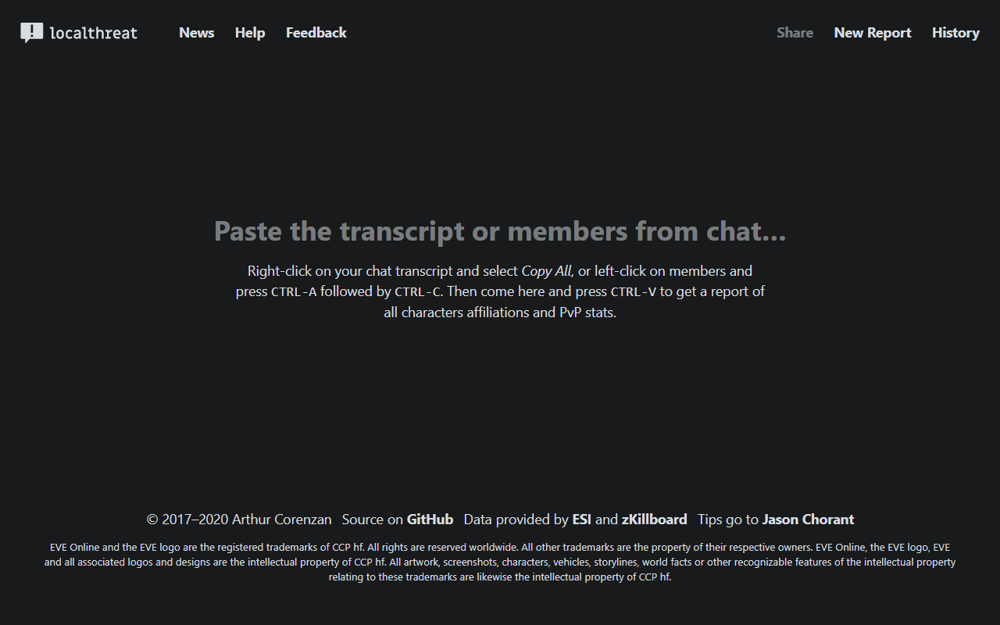

# localthreat   

[](https://localthreat.xyz)

---

## About

**[localthreat](https://localthreat.xyz/)** is an online tool to help EVE players with threat assessment.

## Contribution

I accept **ISK donations** as contributions to the project. If you feel like localthreat has helped you please consider contributing. Send a donation in-game of any value to **Jason Chorant**. This helps to keep me motivated and also with the costs of running and maintaining this service.

## Development

- 👨‍💻 The code and documentation are hosted on [GitHub](https://github.com/haggen/localthreat).
- 🎨 The design lives on [Figma](https://www.figma.com/file/BPH2xeVvbBDAnWpjMI58GpnW/localthreat.next?node-id=0%3A1).
- 🐛 Bug tracking, feature requests, and other feedback must be made on the [repository's issues page](https://github.com/haggen/localthreat/issues/new/choose).

### Docker setup (recommended)

You'll need to be resolving any subdomain of localhost to localhost. If you're using Chrome it does that automatically. Otherwise you'll need to edit your `hosts` file or have something like [dnsmasq](http://www.thekelleys.org.uk/dnsmasq/doc.html) resolving `client-localthreat.localhost` and `api-localthreat.localhost`.

With Docker up and docker-compose installed , run:

```shell
$ docker-compose up
```

This will boot everything you need in one go. You can resume your work later with the same command.

If it's your first run though, you'll need to seed the database. Once the containers are up, run:

```shell
$ docker-compose exec -T db psql -h localhost -U postgres postgres < api/schema.sql
```

You can access the app at http://client-localthreat.localhost and the API at http://api-localthreat.localhost.

### Manual setup

If you don't have Docker or don't want to deal with DNS you can build and run everything locally.

#### API

It's a simple web server written in Go that talks JSON.

You'll need Go 1.15+ installed. Hop into the `api/` sub-directory and run:

```shell
$ go get
```

To download all the dependencies and then:

```shell
$ make
```

To test and build the binary.

You'll also need PostgreSQL 12+ running. Load `api/schema.sql` file into your database and run:

```shell
$ DATABASE_URL=postgres://postgres@localhost/postgres PORT=5000 ./api
```

This will start the API server. You might want to adjust the `DATABASE_URL` and `PORT` values accordingly.

#### Client

It's a [Create React App](https://create-react-app.dev/) written in TypeScript.

You'll need Node 12+ and npm installed. Hop into the `client/` sub-directory and run:

```shell
$ npm install
```

To download all the dependencies and then:

```shell
$ REACT_APP_API_URL=http://localhost:5000 npm run-script start
```

To start the development server. You might want to adjust the `REACT_APP_API_URL` value accordingly.

## Legal

[The MIT License](LICENSE) © 2017 Arthur Corenzan

EVE Online and the EVE logo are the registered trademarks of CCP hf. All rights are reserved worldwide. All other trademarks are the property of their respective owners. EVE Online, the EVE logo, EVE and all associated logos and designs are the intellectual property of CCP hf. All artwork, screenshots, characters, vehicles, storylines, world facts or other recognizable features of the intellectual property relating to these trademarks are likewise the intellectual property of CCP hf.
